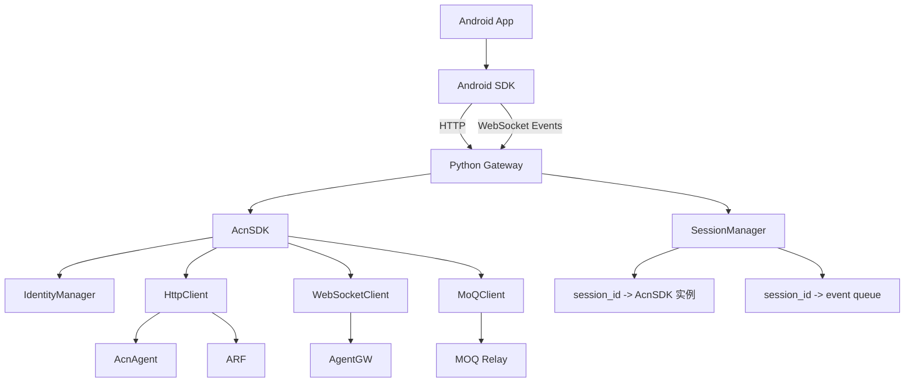
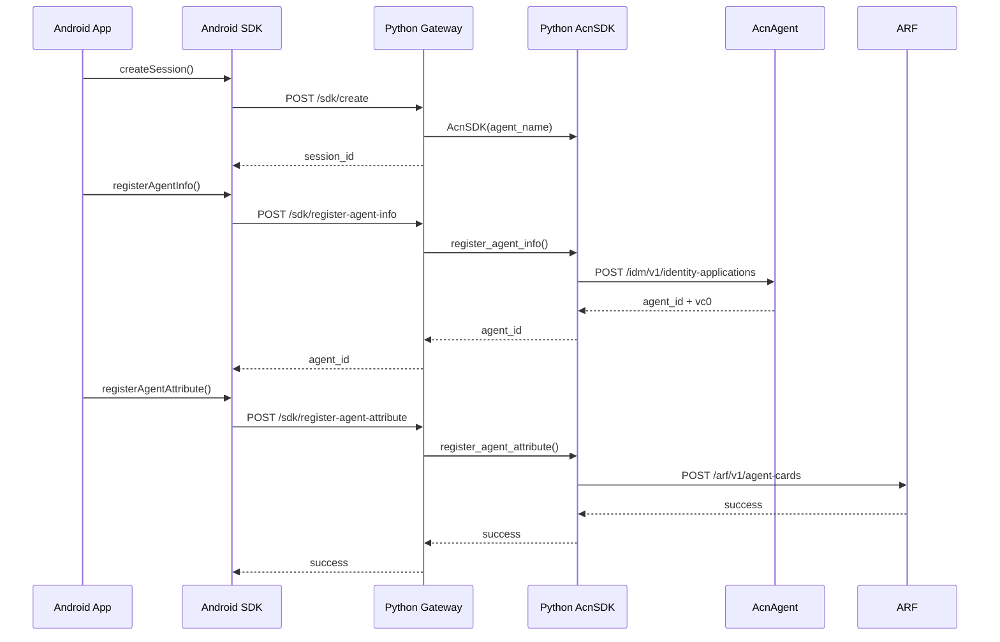
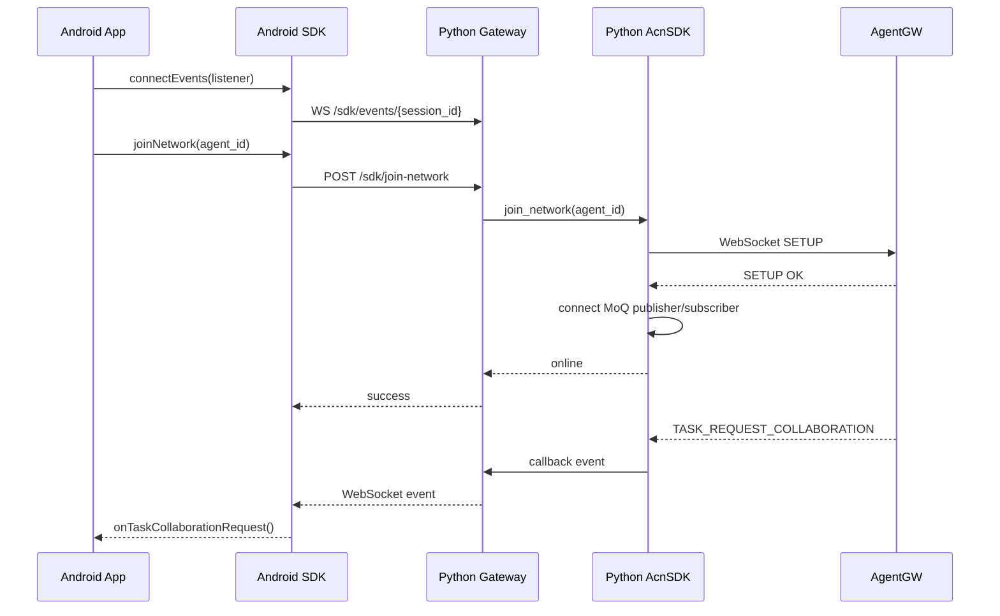
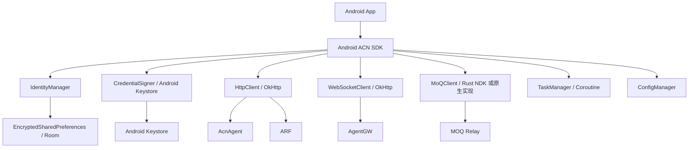

# IMT2030 测试用例 ACN SDK 设计文档

版本：`v0.1.0`

适用范围：IMT2030 测试用例中 Android 终端调用 ACN SDK 能力的设计方案

---

## 1. 两种方案对比

当前仓库中的 `acn_sdk` 是 Python SDK，核心能力包括身份申请、能力注册、入网、任务协同、WebSocket 控制面通信以及 MoQ 数据面传输。若需要在 Android 手机上使用 SDK 能力，主要有两种实现方案：

| 对比项 | 方案一：Android SDK + 服务端 Python Gateway | 方案二：Android 原生 SDK |
| --- | --- | --- |
| 核心思路 | Android SDK 通过 HTTP/WebSocket 调用部署在电脑或服务器上的 Python Gateway，由 Gateway 调用现有 Python SDK | 使用 Kotlin/Java/Rust/NDK 在 Android 端重新实现 SDK 能力 |
| SDK 实际运行位置 | Python SDK 运行在电脑或服务器上，手机是远程调用方 | SDK 运行在 Android 手机上 |
| 对现有代码复用 | 高，可复用当前 `AcnSDK`、`MoQClient`、任务流程、身份流程 | 中低，需要重写大部分协议适配、状态管理和加密逻辑 |
| 开发周期 | 短，适合快速 PoC 和测试用例联调 | 长，适合产品化端侧部署 |
| MoQ/QUIC 处理 | 由 Python Gateway 继续使用当前 Python MoQ 实现 | 需要 Android 端原生实现 MoQ/QUIC，或通过 Rust/NDK 封装 |
| Android 侧复杂度 | 低，只需封装 HTTP/WebSocket 接口 | 高，需要实现完整 SDK 生命周期和协议栈 |
| 网络依赖 | 手机必须能访问 Gateway 所在电脑或服务器 | 手机可独立访问 ACN 网络组件 |
| 端侧真实性 | 手机不是完整 Agent，实际 Agent 能力由 Gateway 承担 | 手机是真正 Agent，端侧能力验证更充分 |
| 延迟 | 多一跳 Gateway 转发，延迟略高 | 链路更短，延迟更低 |
| 运维复杂度 | 需要维护 Gateway 服务和 session 状态 | 需要维护 Android SDK 版本、兼容性和 native 依赖 |
| 安全边界 | Gateway 侧保存 SDK 状态、身份缓存和 MoQ 连接 | Android 本地保存身份、密钥和连接状态 |
| 适用阶段 | 快速验证、测试用例联调、演示、早期集成 | 产品化、真实 Android 终端部署、长期演进 |

综合当前代码状态，建议采用分阶段路线：

```text
第一阶段：Android SDK + 服务端 Python Gateway
  快速复用现有 Python SDK，跑通注册、入网、任务协同和 MoQ 数据转发。

第二阶段：Android 原生 SDK
  在测试用例稳定后，逐步将 HTTP、WebSocket、身份、加密和 MoQ 能力迁移到 Android 本地。
```

---

## 2. 当前 Python SDK 能力基础

### 2.1 当前 SDK 定位

当前仓库实现的是机器人端 Python SDK，入口为：

```text
acn_sdk/sdk.py
```

`AcnSDK` 聚合以下能力：

- 身份申请与去注册
- 能力凭证注册
- Agent 信息查询
- 网络入网与退网
- WebSocket 控制面消息处理
- 任务执行、任务协同、任务终止
- MoQ track 发布、订阅和对象传输
- Pipeline log 上报

### 2.2 当前主要模块

```text
acn_sdk/
├── sdk.py
├── core/
│   ├── identity_service.py
│   ├── network_service.py
│   ├── task_service.py
│   ├── models.py
│   └── settings.py
├── network/
│   ├── http_client.py
│   ├── websocket_client.py
│   └── moq_client.py
├── identity/
├── credential/
├── task/
├── reporting/
└── utils/
```

模块职责如下：

- `AcnSDK`：统一入口，负责初始化配置、日志、密钥、身份管理器和协议客户端。
- `SDKIdentityMixin`：实现身份申请、能力注册、身份查询和去注册。
- `SDKNetworkMixin`：实现入网、退网、WebSocket 消息处理和 MoQ 订阅。
- `SDKTaskMixin`：实现任务执行、任务协同、任务终止和 MoQ 数据上报。
- `HttpClient`：访问 `AcnAgent` 和 `ARF` HTTP 接口。
- `WebSocketClient`：与 `AgentGW` 建立控制面长连接。
- `MoQClient`：基于当前 Python MoQ 实现完成 publish、subscribe、fetch、send_object。
- `IdentityManager`：维护本地 `agent_id`、`vc0`、能力 VC 和 Agent 基础信息。

### 2.3 当前协议依赖

当前 Python SDK 依赖三类外部通信：

| 协议 | 用途 | 当前实现 |
| --- | --- | --- |
| HTTP | 身份申请、能力注册、任务请求、Agent 查询 | `httpx` |
| WebSocket | 入网握手、任务协同控制面、track 发布通知 | `websocket-client` |
| MoQ/QUIC | 任务数据对象发布、订阅、fetch | 当前仓库 `moq` 模块 + `aioquic` |

其中 MoQ/QUIC 是 Android 直接移植成本最高的部分，因此第一阶段建议通过服务端 Python Gateway 保留该能力。

---

## 3. 方案一：Android SDK + 服务端 Python Gateway

### 3.1 方案定位

该方案的目标是在不重写现有 Python SDK 的前提下，让 Android 手机可以调用 ACN SDK 能力。

实现方式是：

```text
Android App
  ↓
Android SDK
  ↓ HTTP / WebSocket
Python Gateway
  ↓ 调用现有 Python AcnSDK
AcnAgent / AgentGW / ARF / MOQ Relay
```

在该方案中：

- Android 手机不直接运行 Python SDK。
- Android 手机不直接实现 MoQ/QUIC。
- Python Gateway 部署在电脑或服务器上。
- Python Gateway 内部持有一个或多个 `AcnSDK` 实例。
- Android SDK 对外暴露类似 SDK 的接口，内部通过 HTTP/WebSocket 访问 Gateway。

### 3.2 逻辑架构



### 3.3 Python Gateway 职责

Python Gateway 是 Android 与 Python SDK 之间的适配层，主要职责包括：

1. Session 管理
   - 为每个 Android 端创建独立 `session_id`
   - 每个 session 绑定一个 `AcnSDK` 实例
   - 隔离不同 Android 终端的身份、任务、MoQ 连接和事件队列

2. API 适配
   - 将 Android 发来的 HTTP 请求转换为 `AcnSDK` 方法调用
   - 将 Python SDK 的 `tuple[bool, str]` 返回值转换为 JSON 响应

3. 事件转发
   - 注册 `AcnSDK.register_callbacks()`
   - 将 SDK 收到的 WebSocket 控制面事件推送给 Android
   - 将 MoQ 数据回调转换为 WebSocket 事件推送给 Android

4. MoQ 代理
   - Android 发来的数据通过 Gateway 调用 `task_info_report()`
   - Gateway 使用 Python `MoQClient` 完成 publish 和 send_object
   - Gateway 收到 MoQ 对象后推送给 Android

5. 生命周期管理
   - 创建 session
   - 入网
   - 退网
   - 销毁 session
   - 释放 WebSocket/MoQ/TaskManager 资源

### 3.4 Python Gateway 对外接口设计

建议 Gateway 暴露以下接口：

| 接口 | 方法 | 说明 |
| --- | --- | --- |
| `/sdk/create` | POST | 创建 SDK session |
| `/sdk/destroy` | POST | 销毁 SDK session 并释放资源 |
| `/sdk/register-agent-info` | POST | 调用 `register_agent_info()` |
| `/sdk/register-agent-attribute` | POST | 调用 `register_agent_attribute()` |
| `/sdk/query-agent-id` | POST | 调用 `query_agent_id()` |
| `/sdk/query-agent-info` | POST | 调用 `query_agent_info()` |
| `/sdk/join-network` | POST | 调用 `join_network()` |
| `/sdk/logout-network` | POST | 调用 `logout_network()` |
| `/sdk/network-status` | POST | 调用 `query_network_status()` |
| `/sdk/request-task-execution` | POST | 调用 `request_task_execution()` |
| `/sdk/request-task-collaboration` | POST | 调用 `request_task_collaboration()` |
| `/sdk/accept-task-collaboration` | POST | 调用 `accept_task_collaboration()` |
| `/sdk/start-task-collaboration` | POST | 调用 `start_task_collaboration()` |
| `/sdk/task-info-report` | POST | 调用 `task_info_report()`，由 Gateway 负责 MoQ 发送 |
| `/sdk/terminate-task` | POST | 调用 `request_terminate_task()` |
| `/sdk/tasks` | POST | 调用 `query_task_list()` |
| `/sdk/events/{session_id}` | WebSocket | Gateway 向 Android 推送 SDK 事件 |

统一响应格式建议如下：

```json
{
  "result": true,
  "message": "",
  "data": {}
}
```

当直接透传当前 Python SDK 返回值时，也可以使用：

```json
{
  "result": true,
  "message": "did:acn:agent:xxx"
}
```

### 3.5 Gateway Session 设计

Gateway 内部维护：

```text
session_id -> SdkSession
```

`SdkSession` 包含：

```text
SdkSession
├── session_id
├── AcnSDK 实例
├── event_queue
├── agent_id
├── created_at
└── last_active_at
```

每个 `SdkSession` 在创建时完成：

1. 初始化 `AcnSDK(agent_name)`
2. 注册 SDK 回调
3. 创建事件队列
4. 等待 Android 调用后续注册、入网和任务接口

### 3.6 Android SDK 职责

Android SDK 是 Gateway 的客户端封装，主要职责包括：

1. 封装 HTTP API
   - 创建 session
   - 注册身份
   - 注册能力
   - 入网/退网
   - 发起任务
   - 上报任务数据

2. 封装事件 WebSocket
   - 连接 `/sdk/events/{session_id}`
   - 将 Gateway 推送的事件转换为 Android 回调

3. 提供 Android 侧统一接口
   - 对 App 屏蔽 Gateway URL、JSON、Base64 编解码等细节
   - 提供接近 Python SDK 的调用体验

建议 Android SDK 结构如下：

```text
acn-android-sdk/
├── AcnSdk.kt
├── GatewayApi.kt
├── AcnEventListener.kt
├── model/
│   ├── AgentInfo.kt
│   ├── SdkResponse.kt
│   ├── TaskRequest.kt
│   └── GatewayEvent.kt
└── network/
    ├── HttpTransport.kt
    └── EventWebSocket.kt
```

### 3.7 Android SDK 对外接口建议

Android SDK 可以暴露以下接口：

```kotlin
class AcnSdk(
    private val gatewayBaseUrl: String,
    private val agentName: String,
) {
    suspend fun createSession(): String

    suspend fun registerAgentInfo(
        name: String,
        owner: String,
        description: String,
        priority: Int = 1,
        metadata: Map<String, Any> = emptyMap(),
    ): String

    suspend fun registerAgentAttribute(
        agentId: String,
        capabilities: List<String>,
    )

    suspend fun joinNetwork(agentId: String)

    suspend fun logoutNetwork(agentId: String)

    suspend fun requestTaskExecution(
        agentId: String,
        taskInfo: String,
        taskId: String? = null,
    ): String

    suspend fun taskInfoReport(
        agentId: String,
        taskId: String,
        topic: String,
        payload: ByteArray,
    )

    fun connectEvents(listener: AcnEventListener)

    suspend fun destroy()
}
```

事件回调建议如下：

```kotlin
interface AcnEventListener {
    fun onTaskCollaborationRequest(payload: String)
    fun onDiscoverResult(payload: String)
    fun onStartTask(payload: String)
    fun onTaskTermination(payload: String)
    fun onSubscribeTrack(payload: String)
    fun onMoqMessage(namespace: String, track: String, payload: ByteArray)
    fun onError(error: Throwable)
}
```

### 3.8 MoQ 数据转发设计

Android 到 MoQ Relay 的数据路径：

```text
Android App
  ↓ ByteArray
Android SDK
  ↓ Base64 + HTTP POST /sdk/task-info-report
Python Gateway
  ↓ sdk.task_info_report(agent_id, task_id, topic, payload)
Python AcnSDK
  ↓ MoQ publish / send_object
MOQ Relay
```

MoQ Relay 到 Android 的数据路径：

```text
MOQ Relay
  ↓ MoQ object
Python AcnSDK MoQ subscriber callback
  ↓ on_message_received(namespace, track, payload)
Python Gateway event queue
  ↓ WebSocket /sdk/events/{session_id}
Android SDK
  ↓ onMoqMessage(namespace, track, payload)
Android App
```

HTTP JSON 传输二进制数据时建议使用 Base64：

```json
{
  "session_id": "session-001",
  "agent_id": "did:acn:agent:001",
  "task_id": "task-001",
  "topic": "camera_frame",
  "payload_base64": "AAECAwQ="
}
```

如果后续传输视频帧、大图像或高频数据，应增加二进制接口：

```text
POST /sdk/task-info-report-binary
Content-Type: application/octet-stream
```

### 3.9 方案一核心流程

#### 3.9.1 初始化与注册流程



#### 3.9.2 入网与事件流程



### 3.10 方案一优点

- 能最大程度复用现有 Python SDK。
- 不需要 Android 端实现 MoQ/QUIC。
- 适合快速跑通 IMT2030 测试用例。
- 便于在电脑上抓日志、调试网络、定位协议问题。
- Android SDK 较轻，主要是 HTTP/WebSocket 客户端封装。
- 可以先验证接口语义和业务流程，再决定是否投入 Android 原生化。

### 3.11 方案一缺点

- 手机不是完整独立 Agent，实际 SDK 状态在 Gateway。
- 手机必须能访问 Gateway 所在电脑或服务器。
- Gateway 成为额外部署组件和故障点。
- 数据链路多一跳，延迟和带宽消耗增加。
- 安全边界集中在 Gateway，需额外考虑鉴权、session 隔离和访问控制。
- 不适合最终要求“手机独立入网、独立收发 MoQ 数据”的产品化场景。

### 3.12 方案一适用场景

该方案适合：

- IMT2030 测试用例快速联调
- Android 端业务界面和控制流程验证
- MoQ 数据链路由服务端托管的演示场景
- 早期 PoC
- 需要快速复用现有 Python SDK 的环境

---

## 4. 方案二：Android 原生 SDK

### 4.1 方案定位

该方案的目标是让 Android 手机本身成为完整 ACN Agent 端侧设备。SDK 全部运行在 Android 本地，不依赖电脑或服务器上的 Python Gateway。

实现方式是：

```text
Android App
  ↓
Android 原生 ACN SDK
  ↓ HTTP / WebSocket / MoQ
AcnAgent / AgentGW / ARF / MOQ Relay
```

在该方案中：

- Android SDK 使用 Kotlin/Java 实现业务接口。
- HTTP 使用 OkHttp 或 Retrofit。
- WebSocket 使用 OkHttp WebSocket。
- 身份、密钥、签名使用 Android Keystore 和 Java Crypto。
- MoQ/QUIC 使用 Rust/NDK、第三方 QUIC 库或自研实现。

当前仓库已按该方案新增 Android 原生 SDK 初始模块：

```text
android/acn-android-sdk/
```

已落地内容包括：

- Android library Gradle 工程骨架
- `AcnSdk` 聚合入口
- `AcnConfig` 配置模型
- Kotlin 数据模型
- OkHttp HTTP 客户端
- OkHttp WebSocket 控制面客户端
- Android Keystore ECDSA 签名
- EncryptedSharedPreferences 身份缓存
- 能力 VC 占位签发逻辑
- MoQ/QUIC Android native 接口边界

当前仍需后续接入的能力：

- Android 原生 MoQ/QUIC 传输实现
- 真机联调和协议一致性测试
- 与现有 Python mock 服务的端到端 Android 测试

### 4.2 逻辑架构



### 4.3 Android 原生 SDK 模块设计

建议 Android SDK 模块结构如下：

```text
acn-android-sdk/
├── build.gradle.kts
├── src/main/java/com/acn/sdk/
│   ├── AcnSdk.kt
│   ├── config/
│   │   └── AcnConfig.kt
│   ├── model/
│   │   ├── AgentInfo.kt
│   │   ├── AgentCardRequest.kt
│   │   ├── TaskExecutionRequest.kt
│   │   ├── TaskTerminationRequest.kt
│   │   └── WebSocketMessage.kt
│   ├── identity/
│   │   └── IdentityManager.kt
│   ├── credential/
│   │   └── CredentialIssuer.kt
│   ├── crypto/
│   │   └── CredentialSigner.kt
│   ├── network/
│   │   ├── AcnHttpClient.kt
│   │   ├── AcnWebSocketClient.kt
│   │   └── MoqClient.kt
│   ├── task/
│   │   └── TaskManager.kt
│   └── callback/
│       └── AcnEventListener.kt
└── src/main/cpp/ 或 rust/
    └── moq_quic_native.*
```

### 4.4 Python SDK 到 Android SDK 的映射

| Python SDK 模块 | Android 原生模块 | 说明 |
| --- | --- | --- |
| `AcnSDK` | `AcnSdk.kt` | 聚合入口 |
| `AgentInfo` 等 Pydantic 模型 | Kotlin data class | 使用 `kotlinx.serialization`、Moshi 或 Gson |
| `HttpClient` | `AcnHttpClient.kt` | 基于 OkHttp/Retrofit |
| `WebSocketClient` | `AcnWebSocketClient.kt` | 基于 OkHttp WebSocket |
| `IdentityManager` | `IdentityManager.kt` | 使用加密存储 |
| `crypto.py` | `CredentialSigner.kt` | Android Keystore + Java Crypto |
| `TaskManager` | `TaskManager.kt` | Kotlin Coroutine/Flow |
| `MoQClient` | `MoqClient.kt` + native 库 | 需要重点设计 |
| `config.yaml` | `AcnConfig.kt` | Android Builder 或 JSON 配置 |
| `register_callbacks()` | `AcnEventListener` | Android 回调接口 |

### 4.5 Android 原生 SDK 对外接口建议

```kotlin
class AcnSdk private constructor(
    private val config: AcnConfig,
) {
    suspend fun registerAgentInfo(agentInfo: AgentInfo): String

    suspend fun registerAgentAttribute(
        agentId: String,
        capabilities: List<String>,
    )

    suspend fun queryAgentId(
        agentName: String,
        owner: String,
    ): String?

    suspend fun deregisterAgent(
        agentId: String,
        reason: String,
    )

    suspend fun joinNetwork(agentId: String)

    suspend fun logoutNetwork(agentId: String)

    fun queryNetworkStatus(agentId: String): NetworkStatus

    suspend fun requestTaskExecution(
        agentId: String,
        taskInfo: String,
        taskId: String? = null,
    ): String

    suspend fun requestTaskCollaboration(
        agentId: String,
        taskId: String,
        requiredCapabilities: List<String>,
    )

    suspend fun acceptTaskCollaboration(
        agentId: String,
        taskId: String,
    )

    suspend fun startTaskCollaboration(
        agentId: String,
        dstAgentId: String,
        taskId: String,
        taskDescription: String,
    )

    suspend fun taskInfoReport(
        agentId: String,
        taskId: String,
        topic: String,
        payload: ByteArray,
    )

    fun setEventListener(listener: AcnEventListener)

    suspend fun disconnectAll()
}
```

### 4.6 MoQ/QUIC 实现选项

Android 原生方案的关键难点是 MoQ/QUIC。可选实现路径如下：

| 实现路径 | 说明 | 优点 | 缺点 |
| --- | --- | --- | --- |
| Rust + NDK | 使用 Rust 实现或封装 MoQ/QUIC，通过 JNI 暴露给 Kotlin | 性能较好，可跨平台复用 | 构建链复杂，需要 JNI 封装 |
| C/C++ + NDK | 使用 C/C++ QUIC/MoQ 库，Android 侧通过 JNI 调用 | 性能好，native 生态成熟 | 开发和调试成本高 |
| Kotlin/Java 原生实现 | 纯 Android 代码实现协议 | 集成简单，无 native 包 | 协议复杂，开发周期长，风险高 |
| 暂时保留 Gateway | Android 原生 SDK 只实现 HTTP/WebSocket，MoQ 暂走 Gateway | 过渡成本低 | 不是完整原生方案 |

建议产品化演进时优先评估 Rust + NDK 路线，因为它更适合后续跨 Android、Linux、边缘设备复用。

### 4.7 Android 本地安全设计

原生 SDK 需要替换当前 Python 文件密钥方案。

当前 Python SDK 使用：

```text
data/keys/private_key.pem
data/keys/public_key.pem
data/identity.json
```

Android 侧建议改为：

- 私钥：Android Keystore
- 身份缓存：EncryptedSharedPreferences 或 Room + 加密
- 证书：`res/raw` 或 App 私有目录
- 签名：Java Crypto 或 BouncyCastle
- 日志：避免输出私钥、VC 完整内容和敏感 payload

### 4.8 方案二优点

- Android 手机是真正独立 Agent。
- 不依赖电脑或 Python Gateway。
- 网络链路更短，延迟更低。
- 更接近最终产品部署形态。
- 可以使用 Android Keystore 等系统安全能力。
- 端侧测试结果更真实。

### 4.9 方案二缺点

- 开发周期长。
- 需要重写当前 Python SDK 大部分能力。
- MoQ/QUIC Android 实现复杂，风险最高。
- Android 生命周期、后台连接、权限、网络切换、电量优化都需要额外处理。
- 需要建立完整 Android 自动化测试和真机兼容性测试体系。
- 与 Python SDK 需要长期保持协议和模型一致。

### 4.10 方案二适用场景

该方案适合：

- 手机必须作为独立 ACN Agent 的场景
- 产品化发布
- 长期端侧部署
- 对低延迟和本地自治要求较高的场景
- 需要验证真实 Android 端侧身份、加密、网络和 MoQ 能力的测试

---

## 5. 两种方案的共同接口语义

无论采用哪种方案，都建议保持 Android 对外接口语义与当前 Python SDK 基本一致。这样可以降低测试用例迁移成本。

### 5.1 身份类接口

| 能力 | Python SDK 方法 | Android/Gateway 建议方法 |
| --- | --- | --- |
| 注册 Agent 身份 | `register_agent_info()` | `registerAgentInfo()` |
| 注册能力 | `register_agent_attribute()` | `registerAgentAttribute()` |
| 查询本地 Agent ID | `query_agent_id()` | `queryAgentId()` |
| 查询 Agent 信息 | `query_agent_info()` | `queryAgentInfo()` |
| 去注册 | `deregister_agent()` | `deregisterAgent()` |

### 5.2 网络类接口

| 能力 | Python SDK 方法 | Android/Gateway 建议方法 |
| --- | --- | --- |
| 入网 | `join_network()` | `joinNetwork()` |
| 退网 | `logout_network()` | `logoutNetwork()` |
| 查询网络状态 | `query_network_status()` | `queryNetworkStatus()` |
| 清理连接 | `disconnect_all()` | `disconnectAll()` |

### 5.3 任务类接口

| 能力 | Python SDK 方法 | Android/Gateway 建议方法 |
| --- | --- | --- |
| 请求任务执行 | `request_task_execution()` | `requestTaskExecution()` |
| 请求任务协同 | `request_task_collaboration()` | `requestTaskCollaboration()` |
| 接受任务协同 | `accept_task_collaboration()` | `acceptTaskCollaboration()` |
| 启动任务协同 | `start_task_collaboration()` | `startTaskCollaboration()` |
| 上报任务数据 | `task_info_report()` | `taskInfoReport()` |
| 终止任务 | `request_terminate_task()` | `requestTerminateTask()` |
| 查询任务状态 | `query_task_status()` | `queryTaskStatus()` |
| 查询任务列表 | `query_task_list()` | `queryTaskList()` |

### 5.4 回调事件

建议统一支持以下事件：

| 事件 | 来源 | 说明 |
| --- | --- | --- |
| `TASK_REQUEST_COLLABORATION` | AgentGW | 收到任务协同请求 |
| `DISCOVER_RESULT` | AgentGW | 收到协同发现结果 |
| `START_TASK` | AgentGW | 收到启动任务指令 |
| `TASK_TERMINATION` | AgentGW | 收到任务终止指令 |
| `SUBSCRIBE_TRACK` | AgentGW | 收到 track 订阅指令 |
| `MOQ_MESSAGE` | MOQ Relay | 收到 MoQ 对象数据 |

---

## 6. 推荐实施计划

### 6.1 第一阶段：实现 Gateway 方案

目标：快速让 Android 手机可以调用当前 Python SDK 能力，支撑 IMT2030 测试用例。

交付项：

1. Python Gateway
   - FastAPI 服务
   - session 管理
   - SDK 方法映射
   - 事件 WebSocket
   - MoQ 数据转发

2. Android SDK
   - Gateway HTTP 客户端
   - Gateway 事件 WebSocket 客户端
   - 对外 SDK 类和事件回调
   - Base64 payload 编解码

3. 测试用例
   - 创建 session
   - 注册身份
   - 注册能力
   - 入网
   - 任务执行
   - 任务协同
   - MoQ 数据上报和接收
   - 退网和销毁 session

### 6.2 第二阶段：Android 原生 SDK 可行性验证

目标：验证 Android 本地替代 Python SDK 的关键风险。

优先级建议：

1. HTTP 接口原生化
2. WebSocket 控制面原生化
3. Android Keystore 签名替代文件私钥
4. 本地身份缓存替代 `identity.json`
5. MoQ/QUIC 原生方案技术选型

### 6.3 第三阶段：Android 原生 SDK 产品化

目标：让 Android 手机成为真正独立 ACN Agent。

交付项：

- 完整 Android SDK
- MoQ/QUIC native 库
- Android 真机兼容性测试
- 网络切换和重连策略
- 后台运行与电量策略
- 安全审计
- 与 Python SDK 协议一致性测试

---

## 7. 风险与应对

| 风险 | 影响方案 | 影响 | 应对措施 |
| --- | --- | --- | --- |
| Gateway session 泄漏 | 方案一 | WebSocket/MoQ 线程残留，资源耗尽 | 增加 `/sdk/destroy`，超时回收 session |
| 多 Android 终端状态串扰 | 方案一 | 身份和任务混乱 | 每个 `session_id` 独立 `AcnSDK` 实例 |
| Gateway 无鉴权 | 方案一 | 非授权手机可调用 SDK | 增加 token、设备白名单或 mTLS |
| Base64 大 payload 开销 | 方案一 | 视频帧或高频数据性能下降 | 大数据改用二进制上传或流式接口 |
| Android 后台 WebSocket 断开 | 两种方案 | 事件丢失 | 增加心跳、重连和事件补偿机制 |
| MoQ/QUIC Android 实现不成熟 | 方案二 | 阻塞原生 SDK 产品化 | 先 Gateway 托管 MoQ，再评估 Rust/NDK |
| Android 密钥迁移不一致 | 方案二 | 签名无法通过服务端校验 | 建立 Python/Android 签名一致性测试 |
| 协议模型分叉 | 两种方案 | 测试用例不稳定 | 使用统一 JSON schema 或 OpenAPI 生成模型 |

---

## 8. 结论

对于当前 IMT2030 测试用例，建议优先采用“Android SDK + 服务端 Python Gateway”方案。

原因如下：

- 当前 Python SDK 已经具备完整身份、入网、任务和 MoQ 能力。
- Android 端直接移植 MoQ/QUIC 成本高，不适合作为第一阶段目标。
- Gateway 方案可以快速验证 Android 业务调用链路。
- 测试用例稳定后，可以以相同接口语义逐步演进到 Android 原生 SDK。

最终推荐路线：

```text
短期：Android SDK 调用 Python Gateway，快速完成 IMT2030 测试用例联调。

中期：将 HTTP、WebSocket、身份和加密能力迁移到 Android 原生 SDK。

长期：完成 MoQ/QUIC Android 原生化，使手机成为完整独立 ACN Agent。
```
