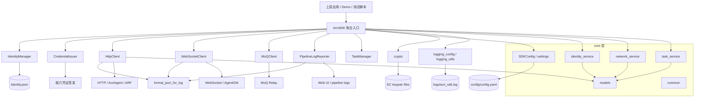
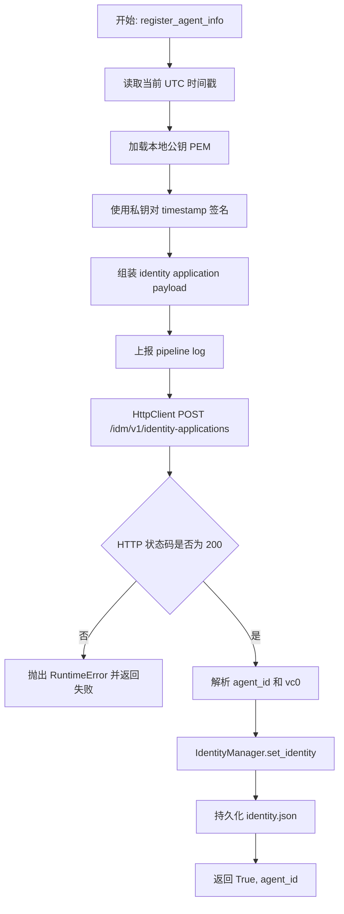
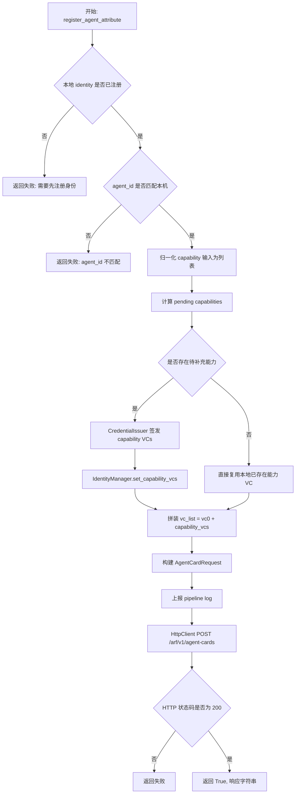
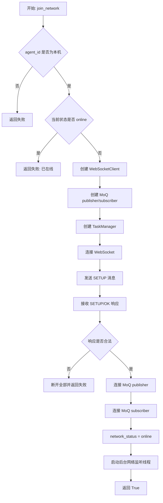
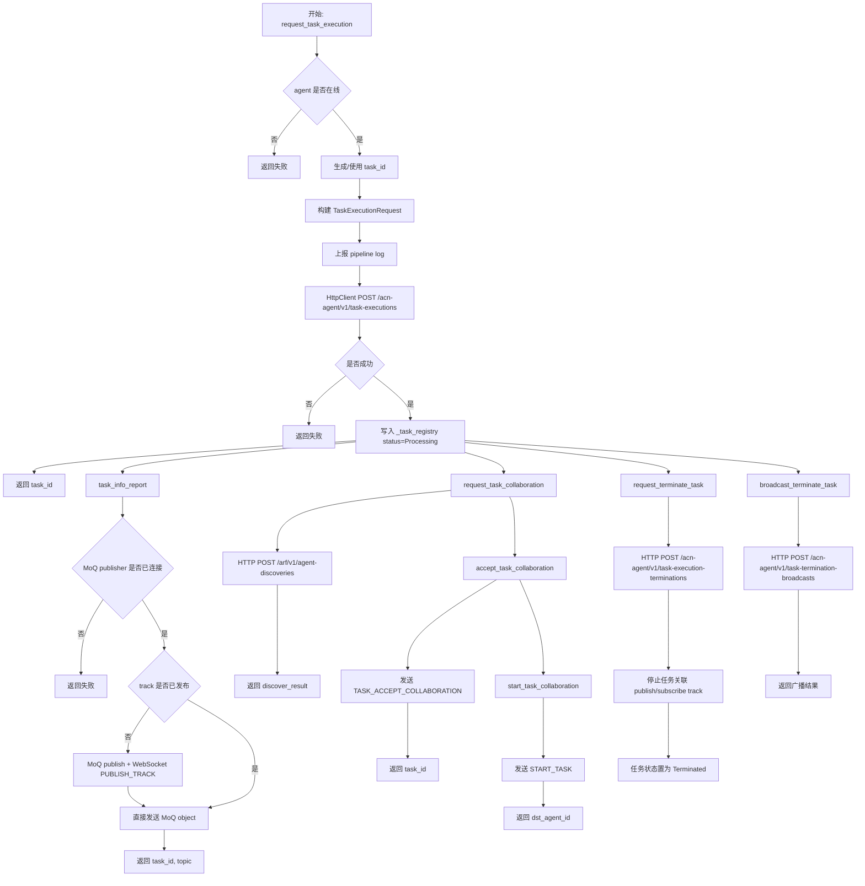
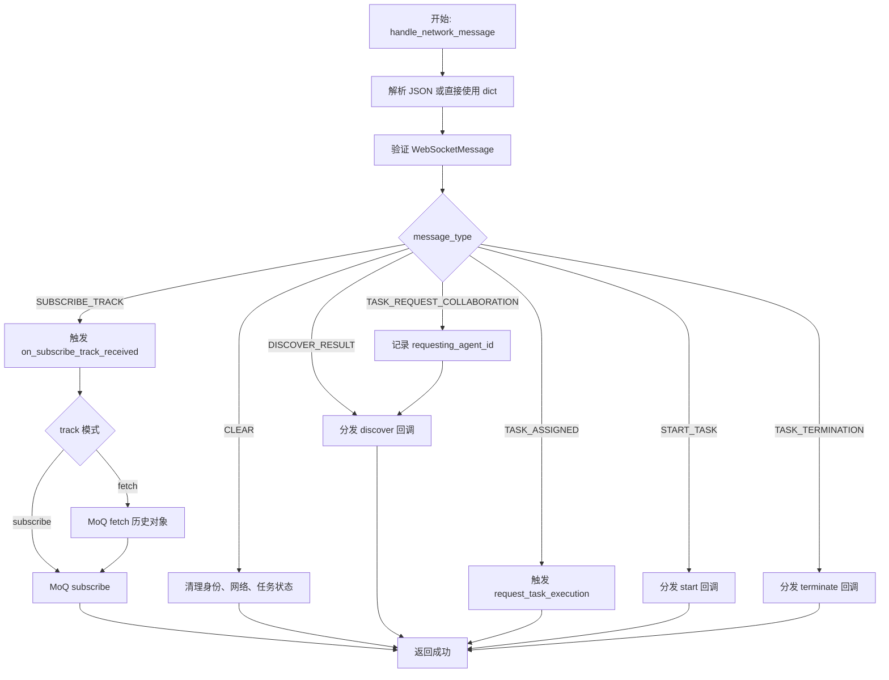
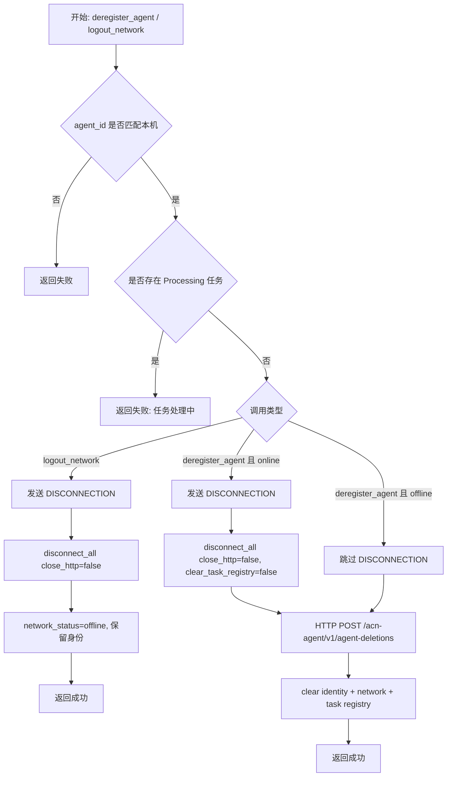
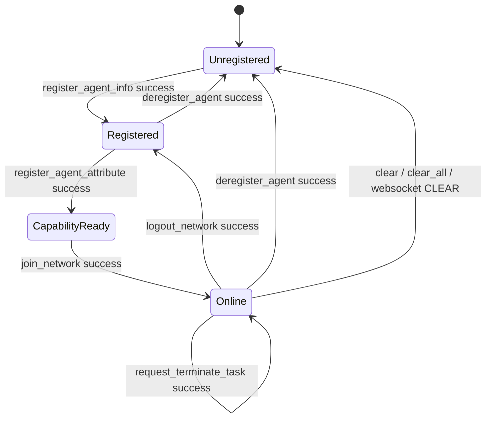
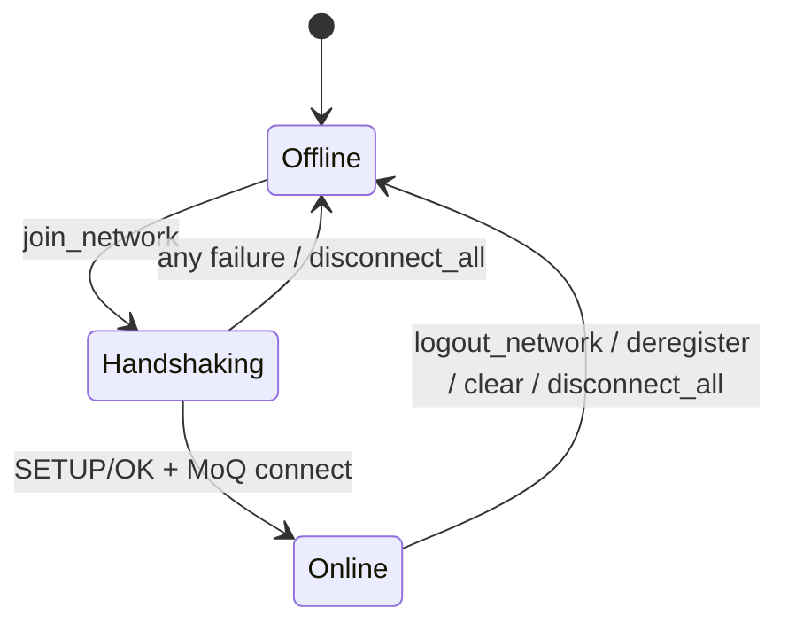
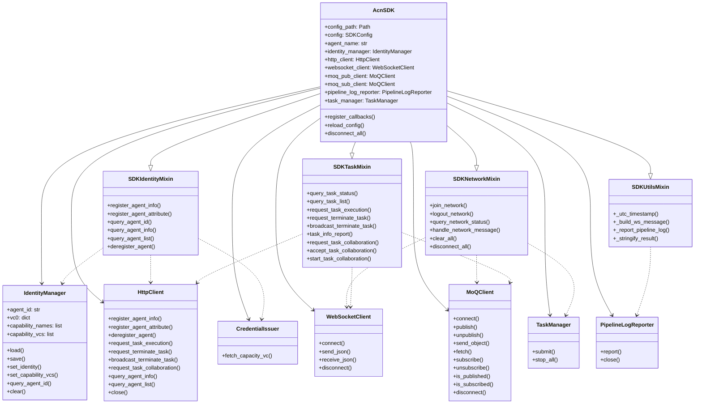

# acn_sdk 软件模块设计书

版本：`v0.1.0`

适用范围：`acn_sdk` 机器人端 Python SDK
---

## 1. 概述

### 1.1 核心定位

`acn_sdk` 是面向端侧设备的 Python SDK，定位于“机器人/物联网终端与服务端协同”的接入层。它不是业务应用本身，而是将端侧设备对外暴露的身份管理、任务协同、数据传输与设备管控能力封装成统一的 SDK 接口，供上层机器人控制程序、边缘控制程序或自动化测试脚本调用。

结合当前代码实现，`acn_sdk` 主要与以下系统交互：

- `AcnAgent`：身份申请、任务执行、去注册等 HTTP 接口入口。
- `ARF`：能力注册、任务协同发现、代理信息查询等 HTTP 接口入口。
- `AgentGW`：网络入网控制面，使用 WebSocket 完成握手、协同消息分发、订阅/发布控制。
- `MOQ Relay`：任务数据面，使用 MoQ 对象流进行 track 发布与订阅。

从场景上看，该 SDK 适用于以下系统：

- 机器人控制系统
- 物联网设备协同系统
- 边缘智能终端与中心控制台联动系统

### 1.2 模块核心功能

基于当前实现，`acn_sdk` 的核心能力可归纳为四类：

1. 端侧设备数字身份申请与管理
   - 申请 `agent_id`
   - 保存并维护 `vc0`
   - 管理能力凭证 `capability_vcs`
   - 提供本地身份查询、去注册、状态清理

2. 多协议数据通信
   - HTTP：与 `AcnAgent`、`ARF` 交互
   - WebSocket：与 `AgentGW` 建立控制面长连接
   - MoQ：与 relay 进行任务数据对象传输

3. 任务与设备管控
   - 任务执行请求
   - 任务协同请求、接受、启动
   - 单任务终止、任务终止广播、任务状态查询、任务列表查询
   - 网络入网/退网、设备状态在线/离线切换

4. 运行时辅助能力
   - 本地日志统一配置
   - pipeline log 上报
   - EC 密钥对生成与复用
   - 回调注册与消息分发
   - 配置热更新与连接重建

### 1.3 设计目标

本 SDK 的设计目标与当前实现约束相匹配，重点包括：

- 高可用：网络异常、HTTP 非 200、WebSocket/MoQ 连接失败时可明确失败返回，并在退出路径上释放资源。
- 可扩展：协议客户端、凭证发放、持久化存储和消息回调可替换、可扩展。
- 可测试：所有核心链路均应支持单元测试、集成测试和 demo 验证，且测试环境不依赖真实核心网。
- 实时性：任务协同链路要求 WebSocket 消息和 MoQ 对象流具备足够低的交互延迟。
- 可维护性：通过分层、mixins、公共模型与统一的返回值约定降低复杂度。

### 1.4 设计原则

当前代码体现出的设计原则如下：

- 高内聚、低耦合：身份、网络、任务逻辑分别由 `SDKIdentityMixin`、`SDKNetworkMixin`、`SDKTaskMixin` 组织。
- 单一职责：`HttpClient` 只负责 HTTP 请求，`WebSocketClient` 只负责长连接收发，`MoQClient` 只负责对象流收发。
- 可替换性：`_create_websocket_client()`、`_create_moq_client()` 使协议客户端具备测试替身替换能力。
- 显式状态：`NETWORK_ONLINE`、`NETWORK_OFFLINE`、`TASK_PROCESSING`、`TASK_TERMINATED` 作为可观测状态常量。
- 失败显式化：公共接口统一返回 `tuple[bool, str]`，失败时给出错误原因，便于调用方处理。

### 1.5 文档用途、适用人群与交付规范

本设计书用于：

- 指导 `acn_sdk` 的后续开发、联调和版本演进
- 作为测试用例设计和评审基线
- 作为 whl 打包、安装、部署和 demo 验收依据

适用人群：

- SDK 开发人员
- 机器人/终端集成人员
- 测试人员
- 架构评审人员

交付规范：

- 与代码实现保持一致
- 以 `acn_sdk` 仓库当前能力为边界，不引入无关组件
- 图、表、流程、状态机需能直接映射到代码对象

### 1.6 4+1 视图对应关系

- 逻辑视图：身份、网络、任务、凭证、报告、工具模块的分层结构。
- 开发视图：`acn_sdk/`、`tests/`、`examples/`、`docs/`、`scripts/`、`mock/` 的工程组织。
- 进程视图：HTTP 同步调用、WebSocket 背景监听线程、MoQ 事件循环线程、任务线程池。
- 物理视图：本地配置文件、密钥文件、日志目录、HTTP/WebSocket/MoQ 外部端点。
- 场景视图：身份注册、入网、任务执行、协同、MoQ 数据传输、去注册。
- 规格视图：`docs/sdd/spec.md` 和 `docs/sdd/plan.md` 作为后续规格驱动开发的基线。

---

## 2. 逻辑架构

### 2.1 整体系统架构

下图基于当前 `acn_sdk/sdk.py` 与 `acn_sdk/core/*`、`acn_sdk/network/*`、`acn_sdk/identity/*`、`acn_sdk/credential/*`、`acn_sdk/task/*`、`acn_sdk/reporting/*` 的实际实现关系整理。



图后说明：

- `AcnSDK` 是统一入口，负责将各个子能力组装成一个可用的终端 SDK。
- `core` 层定义数据模型、配置和跨模块公共逻辑。
- `identity`、`network`、`task`、`credential`、`reporting` 是围绕核心场景拆分出的功能层。
- 文件系统与外部网络端点均在架构图中显式出现，说明 SDK 同时具有“本地状态持久化”和“远程服务协同”两类职责。
- `PipelineLogReporter` 是尽力而为的链路上报组件，请求失败不会阻断 SDK 主流程。

### 2.2 分层描述

#### 2.2.1 接口层

对应 `acn_sdk/sdk.py` 中的 `AcnSDK` 及其对外方法，包括：

- `register_agent_info`
- `register_agent_attribute`
- `query_agent_id`
- `query_agent_info`
- `query_agent_list`
- `join_network`
- `logout_network`
- `query_network_status`
- `request_task_execution`
- `request_terminate_task`
- `broadcast_terminate_task`
- `task_info_report`
- `request_task_collaboration`
- `accept_task_collaboration`
- `start_task_collaboration`
- `query_task_status`
- `query_task_list`
- `handle_network_message`
- `clear_all`
- `disconnect_all`
- `reload_config`
- `register_callbacks`

这一层的职责是：

- 向上层应用提供稳定 API
- 承接参数校验和错误封装
- 将业务动作委派到 mixin 和具体客户端

#### 2.2.2 业务逻辑层

对应 `core/identity_service.py`、`core/network_service.py`、`core/task_service.py`。

- 身份逻辑：注册身份、注册能力、查询身份、去注册。
- 网络逻辑：入网、退网、消息处理、连接管理、轨道订阅。
- 任务逻辑：任务创建、终止、协作、状态查询、任务轨道跟踪。

业务逻辑层依赖：

- `IdentityManager`：本地身份状态
- `HttpClient`：向服务端发起请求
- `WebSocketClient`：控制面通信
- `MoQClient`：数据面通信
- `PipelineLogReporter`：链路日志

#### 2.2.3 数据传输层

对应 `network/http_client.py`、`network/websocket_client.py`、`network/moq_client.py`。

- `HttpClient`：对 HTTP POST 请求做统一封装。
- `WebSocketClient`：对 WebSocket 连接、发送、接收做统一封装。
- `MoQClient`：对 MoQ publisher/subscriber 的连接、发布、订阅、对象发送做统一封装。
- `MoQClient.fetch()`：对订阅方历史对象拉取进行封装，当前由 `SUBSCRIBE_TRACK` 的回调策略触发。

这一层是协议适配边界，原则上不包含业务决策，只处理协议和连接语义。

#### 2.2.4 基础支撑层

对应 `identity/identity_manager.py`、`credential/credential_issuer.py`、`reporting/pipeline_log_reporter.py`、`task/task_manager.py`、`utils/*`、`core/settings.py`、`core/models.py`。

- `IdentityManager`：身份状态持久化。
- `CredentialIssuer`：能力 VC 签发模拟。
- `PipelineLogReporter`：将关键调用路径以固定 `/acn/v3/pipeline-logs` 入口上报到 Web UI。
- `TaskManager`：后台任务线程池管理。
- `SDKConfig`：配置加载/保存。
- `crypto`：密钥对生成、签名。
- `logging`：日志格式化与输出。

### 2.3 关键组件及划分原则

#### 2.3.1 身份管理组件

来源：

- `acn_sdk/identity/identity_manager.py`
- `acn_sdk/core/identity_service.py`

划分依据：

- 身份申请、能力扩展、去注册属于同一生命周期
- 既需要远程交互，又需要本地持久化

职责：

- 维护 `agent_id`
- 维护 `vc0`
- 维护 `capability_names`、`capability_vcs`
- 维护 `agent_name`、`owner`、`priority`、`metadata`
- 支持 `query_agent_id`、`clear`、`save`、`load`

#### 2.3.2 通信组件

来源：

- `acn_sdk/network/http_client.py`
- `acn_sdk/network/websocket_client.py`
- `acn_sdk/network/moq_client.py`

划分依据：

- 按协议拆分，避免协议细节侵入业务层
- HTTP、WebSocket、MoQ 的连接模型和错误模型不同

职责：

- HTTP：身份申请、能力注册、任务执行、任务终止、协同发现、查询操作
- WebSocket：入网握手、消息控制、轨道订阅通知、协同确认、任务启动、任务终止通知和断开
- MoQ：任务对象发布、订阅、历史 fetch 和对象回调

#### 2.3.3 接口适配组件

来源：

- `AcnSDK._apply_config()`
- `SDKNetworkMixin._create_websocket_client()`
- `SDKNetworkMixin._create_moq_client()`

划分依据：

- 外部协议客户端的创建过程应封装在 SDK 内部
- 便于测试替身注入和未来协议替换

#### 2.3.4 任务编排组件

来源：

- `acn_sdk/task/task_manager.py`
- `acn_sdk/core/task_service.py`

划分依据：

- 任务执行、协同、终止、状态跟踪同属任务生命周期
- 需要统一维护 `_task_registry`

### 2.4 逻辑接口设计

#### 2.4.1 内部接口

内部接口主要用于 mixin、工具函数与客户端之间的协作。

- `_build_ws_message(message_type, payload)`
  - 功能：生成标准 WebSocket 消息封装
  - 参数：`message_type`、`payload`
  - 返回：`dict[str, Any]`

- `_report_pipeline_log(...)`
  - 功能：将关键业务步骤上报到 Web UI
  - 参数：协议、目标、方法、URL、头、摘要、内容、任务 ID
  - 返回：无

- `_track_key(namespace, track)`
  - 功能：组合 MoQ track 的内部键
  - 返回：`"{namespace}::{track}"`

- `_subscribe_track_mode_for(track_info, track_modes)`
  - 功能：为单个 track 选择订阅模式
  - 返回：`"subscribe"` 或 `"fetch"`

- `_summarize_task_entry(task_id, task_entry)`
  - 功能：将任务内部状态转换为对外可查询结构
  - 返回：JSON 可序列化的字典

#### 2.4.2 外部接口

外部接口按服务端/控制面/数据面的交互划分。

- HTTP 到 `AcnAgent`
  - `/idm/v1/identity-applications`
  - `/acn-agent/v1/agent-deletions`
  - `/acn-agent/v1/task-executions`
  - `/acn-agent/v1/task-execution-terminations`
  - `/acn-agent/v1/task-termination-broadcasts`
  - `/acn-agent/v1/owner-agents`

- HTTP 到 `ARF`
  - `/arf/v1/agent-cards`
  - `/arf/v1/agent-discoveries`
  - `/arf/v1/agent-info`

- WebSocket 到 `AgentGW`
  - `SETUP`
  - `DISCONNECTION`
  - `PUBLISH_TRACK`
  - `TASK_ACCEPT_COLLABORATION`
  - `START_TASK`
  - `SUBSCRIBE_TRACK`
  - `TASK_REQUEST_COLLABORATION`
  - `DISCOVER_RESULT`
  - `TASK_ASSIGNED`
  - `TASK_TERMINATION`
  - `CLEAR`

- MoQ 到 relay
  - publish / unpublish track
  - send_object
  - fetch track history
  - subscribe / unsubscribe track

### 2.5 技术选型

#### 2.5.1 当前技术栈

- Python 3.10+
- `pydantic`：请求/配置模型校验
- `PyYAML`：配置文件读写
- `httpx`：HTTP 同步请求
- `websocket-client`：WebSocket 长连接
- `aioquic` + `moq`：MoQ 对象流
- `cryptography`：EC 密钥、签名
- `pytest`：单元与集成测试

#### 2.5.2 选型理由

- Python：适合 SDK 封装、脚本式调用和快速集成。
- `pydantic`：把请求模型、配置模型和消息模型结构化，降低接口歧义。
- `httpx`：统一同步 HTTP 客户端，便于在测试中替换 session。
- `websocket-client`：满足 AgentGW 控制面长连接需求，易于同步接口封装。
- `moq`：匹配任务数据流场景，支持 track 级发布/订阅。
- `cryptography`：满足端侧签名和本地密钥生成需求。
- `pytest`：与当前仓库测试风格一致，适合通过 monkeypatch 和假实现验证可测试性。

### 2.6 可测试性设计

可测试性不是附属要求，而是本 SDK 的核心非功能需求之一。结合当前代码，其设计和落地方式如下：

#### 2.6.1 设计阶段的可测试性约束

- 所有公共 API 返回统一的 `tuple[bool, str]`，避免测试断言时需要区分异常与返回值两套语义。
- 关键状态被显式持久化或显式保存在内存字典中，例如 `IdentityManager` 和 `_task_registry`。
- 协议客户端被封装为独立类，避免业务逻辑中直接依赖底层库。
- 配置通过 `SDKConfig.load()` 和 `SDKConfig.save()` 管理，测试可通过临时 YAML 隔离环境。

#### 2.6.2 开发阶段的可测试性手段

- `HttpClient` 接受可注入的 `session` / `arf_session`，可直接替换为假 session。
- `WebSocketClient` 可以通过 monkeypatch `websocket.create_connection` 注入假连接。
- `MoQClient` 的 `_create_moq_client()` 是明确的工厂封装，便于在测试中替换为 `RecordingMoQClient`。
- `PipelineLogReporter` 可在测试中替换为记录器，不依赖真实 Web UI。
- `ensure_ec_keypair()` 和签名函数具备确定性输入，可直接做加密验证。
- `IdentityManager` 支持从旧版单能力字段 `capability_vc` 迁移到当前 `capability_vcs` 列表，便于做兼容性测试。

#### 2.6.3 测试阶段的可测试性要求

- 单元测试覆盖纯函数、状态转换、请求体构造和错误路径。
- 集成测试覆盖身份申请、能力注册、入网、任务执行、协同、MoQ 发布/订阅和退网路径。
- demo 用例作为可演示的回归测试，验证真实调用顺序和链路拼接。

#### 2.6.4 可测试性的风险控制

- 避免在业务逻辑中直接创建不可替换的全局对象。
- 避免在测试里依赖系统环境代理、真实网络或真实证书服务。
- 对涉及线程和异步事件循环的对象，要提供可关闭、可替身、可等待的测试入口。

---

## 3. 详细设计

### 3.1 第一层：大颗粒度模块划分

#### 3.1.1 身份管理模块

组成：

- `SDKIdentityMixin`
- `IdentityManager`
- `CredentialIssuer`

职责：

- 发起身份申请
- 签发和注册能力凭证
- 查询本地或远端身份信息
- 去注册时清理身份状态

#### 3.1.2 数据通信模块

组成：

- `HttpClient`
- `WebSocketClient`
- `MoQClient`

职责：

- 对不同协议进行稳定封装
- 统一日志输出
- 支撑控制面和数据面的消息传输

#### 3.1.3 设备管控模块

组成：

- `SDKNetworkMixin`
- `SDKTaskMixin`
- `TaskManager`

职责：

- 入网/退网
- 任务创建/终止/查询
- 协同处理
- 轨道订阅发布

#### 3.1.4 基础支撑模块

组成：

- `SDKConfig`
- `models`
- `crypto`
- `logging_config`
- `logging_utils`
- `PipelineLogReporter`

职责：

- 配置管理
- 模型校验
- 密钥处理
- 日志和链路上报

### 3.2 第二层：细颗粒度功能设计

#### 3.2.1 端侧设备申请数字身份

对应实现：

- `SDKIdentityMixin.register_agent_info()`
- `HttpClient.register_agent_info()`
- `IdentityManager.set_identity()`
- `utils.crypto.load_public_key_pem()`
- `utils.crypto.sign_timestamp()`

流程图如下：



说明：

- 身份申请的关键输入来自本地密钥对和设备静态信息。
- 签名粒度是 `timestamp`，与测试中的签名验证保持一致。
- 成功后身份状态必须持久化，以支持重启后的续用。
- `AcnSDK` 初始化时会清理配置指向的旧身份缓存文件，当前行为更偏向 demo/测试隔离；如果后续要支持跨进程复用身份，需要先调整该约束。

#### 3.2.2 数字身份与能力管理

对应实现：

- `SDKIdentityMixin.register_agent_attribute()`
- `IdentityManager.get_pending_capabilities()`
- `IdentityManager.set_capability_vcs()`
- `CredentialIssuer.fetch_capacity_vc()`

流程图如下：



说明：

- `IdentityManager.get_pending_capabilities()` 负责去重，避免重复签发和重复注册。
- `CredentialIssuer` 根据能力名选择不同发行者 DID 和证书私钥，体现能力归属区分。
- 当前实现采用本地签发模拟第三方能力 VC，利于 demo 与测试。

#### 3.2.3 网络入网与会话建立

对应实现：

- `SDKNetworkMixin.join_network()`
- `SDKNetworkMixin._create_websocket_client()`
- `SDKNetworkMixin._create_moq_client()`
- `WebSocketClient.connect()`
- `MoQClient.connect()`
- `TaskManager()`

流程图如下：



说明：

- 入网先完成控制面握手，再建立数据面能力，顺序与当前 demo 脚本一致。
- 失败时调用 `disconnect_all(close_http=False)` 做回滚，保证资源清理。
- 该流程是进程视图中的核心：WebSocket 监听线程和 MoQ 事件循环线程在此阶段开始工作。

#### 3.2.4 任务执行、上报与协同

对应实现：

- `SDKTaskMixin.request_task_execution()`
- `SDKTaskMixin.task_info_report()`
- `SDKTaskMixin.request_task_collaboration()`
- `SDKTaskMixin.accept_task_collaboration()`
- `SDKTaskMixin.start_task_collaboration()`
- `SDKTaskMixin.request_terminate_task()`
- `SDKTaskMixin.broadcast_terminate_task()`

流程图如下：



说明：

- `task_info_report()` 体现控制面与数据面的联动：首次发布 track 时先发送 `PUBLISH_TRACK`，再发送 MoQ 对象。
- `_task_registry` 是任务生命周期的核心状态容器，记录任务描述、状态、已发布/订阅的 track。
- 单任务终止时会调用 `_stop_task_tracks()`，防止资源泄漏。
- 任务终止广播只负责向 AcnAgent 发送广播请求，不直接修改本地任务状态。

#### 3.2.5 网络消息接收与回调分发

对应实现：

- `SDKNetworkMixin.handle_network_message()`
- `SDKUtilsMixin._dispatch_message_callback()`
- `AcnSDK.register_callbacks()`

该部分采用了观察者模式，详见 3.4。

流程图如下：



说明：

- `TASK_REQUEST_COLLABORATION` 会写入 `_task_registry`，为后续 `accept_task_collaboration()` 提供 `requesting_agent_id`。
- `CLEAR` 的语义是全量清理，因此要求终止处理中的任务并断开连接。
- `SUBSCRIBE_TRACK` 支持业务回调按 `"{namespace}::{track}"` 返回 `subscribe` 或 `fetch` 模式；`fetch` 模式先拉取历史对象，再建立实时订阅。
- `TASK_ASSIGNED` 会检查 `assigned_agents`，仅当本机被分配或列表为空/无效时触发本地 `request_task_execution()`。

#### 3.2.6 去注册与资源回收

对应实现：

- `SDKIdentityMixin.deregister_agent()`
- `SDKNetworkMixin.logout_network()`
- `SDKNetworkMixin.disconnect_all()`
- `SDKUtilsMixin._clear_identity_and_network_state()`

流程图如下：



说明：

- 业务上强制要求“处理中任务不可直接退网/去注册”，避免状态机不一致。
- 退网只断开网络资源并保留本地身份。
- 去注册在线时先发送 `DISCONNECTION` 并释放网络资源，再执行 HTTP 去注册请求；成功后清理身份、连接、任务和 track 状态。

### 3.3 状态机设计

#### 3.3.1 数字身份生命周期状态机



状态说明：

- `Unregistered`：本地无有效 `agent_id`。
- `Registered`：已有 `agent_id` 和 `vc0`。
- `CapabilityReady`：已注册能力 VC，具备可协同能力。
- `Online`：已完成网络入网，可进行任务执行和协同。
- 任务终止不会导致设备离线，只会停止任务关联 track 并把任务状态置为 `Terminated`。
- `logout_network()` 保留本地身份，`deregister_agent()` 和 `CLEAR` 会清空本地身份。

#### 3.3.2 设备连接状态机



状态切换条件：

- `join_network()` 触发 `Offline -> Handshaking`
- `SETUP/OK` 且 MoQ 连接成功后进入 `Online`
- 任一连接失败进入 `Offline`
- `logout_network()`、`deregister_agent()`、`clear_all()`、`disconnect_all()` 导致 `Online -> Offline`

### 3.4 类图设计

以下类图抽取当前代码中的核心对象关系，重点体现 mixin 组合、组件依赖与回调关系。



说明：

- `AcnSDK` 采用 mixin 组合方式组织行为，避免把所有逻辑堆入单一巨类。
- `SDKNetworkMixin` 和 `SDKTaskMixin` 通过对 `self` 的协作访问共享状态，不引入额外的跨模块依赖对象。

### 3.5 模块依赖设计

#### 3.5.1 依赖方向

推荐依赖方向如下：

- `sdk.py` 依赖 `core/*`、`identity/*`、`network/*`、`credential/*`、`task/*`、`reporting/*`、`utils/*`
- `core/identity_service.py`、`core/network_service.py`、`core/task_service.py` 依赖 `core/models.py`、`core/common.py`、`network/*`、`task/*`
- `network/*` 只依赖 `core/models.py`、`utils/*`、第三方协议库
- `identity/*` 只依赖标准库和持久化路径
- `credential/*` 只依赖加密库和本地证书文件
- `reporting/*` 只依赖 HTTP 客户端和 JSON 工具

#### 3.5.2 循环依赖规避

当前实现的关键做法是：

- 模型统一放在 `core/models.py`
- 状态常量统一放在 `core/common.py`
- 配置统一放在 `core/settings.py`
- 业务 mixin 只依赖 `self` 的已存在属性，不反向导入 `AcnSDK`

如果后续新增模块，建议继续遵守以下规则：

- 任何协议客户端不得反向依赖 SDK 业务层
- 公共数据结构只允许向下共享，不允许循环引用
- 回调只通过函数对象或协议接口传递，不通过全局变量共享

### 3.6 设计模式应用

#### 3.6.1 观察者模式

当前实现中最明确、最贴合业务的设计模式是观察者模式。

对应代码：

- `AcnSDK.register_callbacks()`
- `SDKUtilsMixin._dispatch_message_callback()`
- `SDKNetworkMixin.handle_network_message()`

应用场景：

- `TASK_REQUEST_COLLABORATION`
- `DISCOVER_RESULT`
- `START_TASK`
- `TASK_TERMINATION`
- `SUBSCRIBE_TRACK` 的 `fetch` / `subscribe` 选择
- `on_message_received` 的 MoQ 对象回调

模式价值：

- 上层业务可以按需注册回调，而无需修改 SDK 内部消息分发逻辑。
- 单元测试可以直接注入 lambda 或 mock 函数，验证回调触发顺序。
- 新增消息类型时，只需扩展分发逻辑，不需要改变业务调用侧签名。

#### 3.6.2 策略模式

当前实现中 `on_subscribe_track_received` 回调体现了轻量策略模式。

对应代码：

- `AcnSDK.register_callbacks(on_subscribe_track_received=...)`
- `SDKNetworkMixin._dispatch_subscribe_track_callback()`
- `SDKNetworkMixin._normalize_subscribe_track_modes()`
- `SDKNetworkMixin._subscribe_track_mode_for()`

应用场景：

- 业务侧可按 `"{namespace}::{track}"` 选择接收策略。
- 默认策略为 `subscribe`。
- 指定 `fetch` 时，SDK 先调用 `MoQClient.fetch()` 拉取历史对象，再调用 `MoQClient.subscribe()` 建立实时订阅。

约束：

- 回调返回值只能是 `None` 或 `dict[str, str]`。
- 字典 key 和 value 必须都是字符串。
- value 只能是 `subscribe` 或 `fetch`。

#### 3.6.3 工厂方法

当前实现中已存在轻量的工厂方法封装：

- `SDKNetworkMixin._create_websocket_client()`
- `SDKNetworkMixin._create_moq_client(role)`

应用场景：

- 在正式运行时创建真实协议客户端
- 在测试中替换为 mock/recording client
- 在后续版本中切换成重试版、鉴权版、异步版客户端

优势：

- 降低构造逻辑与业务逻辑耦合
- 便于测试替身注入
- 适合协议适配扩展

#### 3.6.4 说明：未采用全局单例

当前 SDK 没有采用全局单例模式，这是合理的：

- 多实例 demo 已经存在，例如 `demo_task_flow.py` 和 `demo_task_flow_realtime.py`
- 多实例更利于测试隔离
- 配置、身份、密钥均属于实例态，不适合共享为全局单例

### 3.7 关键实现约束

- 所有对外 API 需要保持 `tuple[bool, str]` 返回约定。
- 身份与任务状态切换必须先校验 `agent_id`。
- 任务未结束前不得退网或去注册。
- 发送 MoQ 对象前，track 必须已经 `publish()`。
- 普通控制面消息回调必须只接收单个 payload 参数，否则会触发 `TypeError`。
- `on_message_received` 必须接收 `namespace`、`track`、`payload` 三个参数。
- `on_subscribe_track_received` 返回非法模式时不执行 MoQ 操作。
- `TASK_ASSIGNED` 只有在本机位于 `assigned_agents` 中，或该字段缺失/无有效列表时，才触发本地任务执行。
- `PipelineLogReporter` 失败不影响主流程，因此 pipeline log 只作为观测能力，不作为业务成功条件。

## 4. 测试策略

### 4.1 单元测试策略

#### 4.1.1 测试范围

单元测试应覆盖以下内容：

- 核心类
  - `IdentityManager`
  - `HttpClient`
  - `WebSocketClient`
  - `MoQClient`
  - `PipelineLogReporter`
  - `TaskManager`

- 核心方法
  - `_utc_timestamp()`
  - `_stringify_result()`
  - `_build_ws_message()`
  - `_track_key()`
  - `_summarize_task_entry()`
  - `get_pending_capabilities()`
  - `_build_full_track_name()`

- 关键接口
  - 身份注册/能力注册
  - 入网/退网
- 任务执行/终止
- MoQ publish/subscribe/fetch
- 配置重载、身份缓存清理、旧身份文件兼容

#### 4.1.2 测试工具

- `pytest`
- `monkeypatch`
- `caplog`
- 假 HTTP session / 假 WebSocket connection / 假 MoQ 实现

#### 4.1.3 测试用例设计原则

- 正常路径与异常路径都要覆盖
- 参数校验应优先覆盖空值、错配和重复输入
- 以状态变化为断言重点，而不只是返回值
- 任何外部依赖必须可替换为测试替身

#### 4.1.4 与当前实现对应的单测实践

当前仓库已通过测试验证以下行为：

- 身份申请和能力注册的签名、返回值、持久化
- 本地与远端 agent 信息查询、owner 维度 agent 列表查询
- HTTP 请求日志格式
- WebSocket 日志格式
- MoQ 连接、发布、订阅、fetch、断开清理和跨线程串行访问
- 配置热更新
- 任务状态与轨道状态同步
- 任务终止广播请求路径和 `force` 字段格式
- `SUBSCRIBE_TRACK` 回调策略、非法模式拒绝、重复 track 去重
- `CLEAR` 和 `clear_all()` 强制清理处理中任务
- `HttpClient` 禁用系统代理继承
- EC 密钥生成、旧 RSA 密钥替换和能力 VC 发行者签名验证

### 4.2 集成测试策略

#### 4.2.1 测试场景

- 身份申请 -> 能力注册 -> 入网 -> 任务执行 -> 协同 -> MoQ 上报 -> 终止 -> 去注册
- `TASK_REQUEST_COLLABORATION`、`DISCOVER_RESULT`、`START_TASK`、`SUBSCRIBE_TRACK`、`TASK_TERMINATION` 的消息闭环
- `CLEAR` 消息触发的全量状态清理
- 网络异常和服务异常下的回滚

#### 4.2.2 测试流程

1. 准备临时配置目录和密钥目录。
2. 启动 mock 服务或使用测试替身。
3. 创建 `AcnSDK` 实例。
4. 完成身份注册与能力注册。
5. 执行网络入网。
6. 发起任务执行与协同。
7. 验证 MoQ track 发布/订阅和对象回调。
8. 验证任务终止、任务终止广播和 track 清理。
9. 执行退网/去注册并验证资源清理。

#### 4.2.3 测试环境要求

- Python 3.10+
- 本地临时目录可写
- 可选 mock 服务：`mock_acn_agent`、`mock_arf`、`mock_agent_gw`、`mock_moq_relay`
- 允许使用真实加密库生成密钥对

### 4.3 demo 用例测试

#### 4.3.1 数字身份申请 demo

对应脚本：

- `examples/demo_identity_flow.py`

测试内容：

- 身份申请
- 能力注册
- 身份查询
- 去注册

测试步骤：

1. 运行 mock 服务。
2. 启动 demo。
3. 观察 `agent_id`、能力注册响应和去注册响应。

预期结果：

- `agent_id` 生成成功，格式为 `did:acn:agent:*`
- 能力注册时去重生效
- 去注册后本地身份状态被清空

异常场景：

- 设备 ID 不匹配
- HTTP 非 200
- 重复能力注册

#### 4.3.2 数据通信 demo

对应脚本：

- `examples/demo_task_flow.py`
- `examples/demo_task_flow_realtime.py`
- `examples/demo_task_initiator*.py`
- `examples/demo_task_collaborator*.py`

测试内容：

- WebSocket 握手
- MoQ 发布/订阅
- task_info_report 对象上报
- 协同消息收发

测试步骤：

1. 启动 mock 服务和 relay。
2. 两个 SDK 实例分别扮演 initiator / collaborator。
3. 验证 `PUBLISH_TRACK`、`START_TASK`、`SUBSCRIBE_TRACK` 的消息顺序。
4. 验证 MoQ payload 可被对端回调接收。

预期结果：

- 控制面和数据面联动成功
- 协同消息驱动任务状态推进
- 终止后 track 被正确退订和取消发布
- callback 版 demo 可按 track 选择 `fetch` 或 `subscribe` 接收模式

异常场景：

- 未入网时调用 `task_info_report`
- track 未 publish 直接 send_object
- collaborator 未收到 `requesting_agent_id`

#### 4.3.3 设备管控 demo

测试内容：

- join/logout 的在线状态切换
- task registry 的状态和清理
- CLEAR 消息导致的强制回收

预期结果：

- 处理中任务时拒绝退网与去注册
- `clear_all()` 与 WebSocket `CLEAR` 行为一致

### 4.4 测试覆盖重点

- 身份和任务的状态迁移
- 失败后资源是否完全释放
- 事件顺序是否符合流程设计
- 日志是否包含足够的诊断信息
- 配置热更新是否真正影响运行中的实例
- 旧 identity 文件、重复能力、重复订阅和非法回调返回值是否被正确处理

---

## 5. 部署方式

### 5.1 whl 包生成流程

本仓库使用 `pyproject.toml` + `setuptools.build_meta` 构建，当前项目名为 `acn-sdk`，安装后模块名为 `acn_sdk`。

#### 5.1.1 环境准备

建议使用隔离环境：

```bash
python3 -m venv .venv
source .venv/bin/activate
```

#### 5.1.2 依赖安装

开发阶段建议安装依赖和编辑模式：

```bash
pip install -r requirements.txt
pip install -e .
```

如果只负责构建 whl：

```bash
pip install build
```

#### 5.1.3 打包命令

```bash
python -m build
```

构建产物通常位于：

- `dist/acn_sdk-0.1.0-py3-none-any.whl`
- `dist/acn_sdk-0.1.0.tar.gz`

#### 5.1.4 配置修改

构建前需确认：

- `acn_sdk/config/config.yaml` 中的默认地址是否与目标环境匹配
- `storage.identity_file`
- `storage.private_key_file`
- `storage.public_key_file`
- `storage.log_dir`

对于 demo 或多实例部署，建议在运行时复制一份配置并修改为独立工作目录。

### 5.2 whl 包使用方法

#### 5.2.1 安装命令

```bash
pip install dist/acn_sdk-0.1.0-py3-none-any.whl
```

#### 5.2.2 导入方式

```python
from acn_sdk import AcnSDK, AgentInfo, SDKConfig
```

#### 5.2.3 简单调用示例

```python
from acn_sdk import AcnSDK, AgentInfo

sdk = AcnSDK(agent_name="AliceAgent")
ok, agent_id = sdk.register_agent_info(
    AgentInfo(
        name="AliceAgent",
        owner="+8613800138000",
        description="AgentModel-X, SN123456",
        priority=5,
        metadata={"region": "CN"},
    )
)

if ok:
    sdk.register_agent_attribute(agent_id, ["pick", "place"])
    sdk.join_network(agent_id)
```

### 5.3 部署注意事项

#### 5.3.1 环境兼容性

- Python 版本要求：`>=3.10`
- Linux / Ubuntu / Windows 均可运行，但 WebSocket/MoQ 依赖需先验证平台兼容性

#### 5.3.2 依赖冲突解决

- `httpx` 和 `websocket-client` 需避免被系统代理环境劫持
- 当前 `HttpClient` 使用 `trust_env=False`，可规避 shell 代理污染
- 证书和加密依赖应与系统 OpenSSL 版本兼容

#### 5.3.3 版本管理

- 通过 `pyproject.toml` 中的版本号管理发布版本
- 代码、测试、配置和 demo 必须同步验证后再升级
- 破坏性接口变更应保持 `tuple[bool, str]` 约定不变，避免上层调用方大面积调整

#### 5.3.4 运行目录

运行时涉及以下持久化内容：

- 身份文件
- EC 私钥/公钥
- 日志目录

建议每个实例使用独立目录，避免多进程并发写同一身份文件。

---
