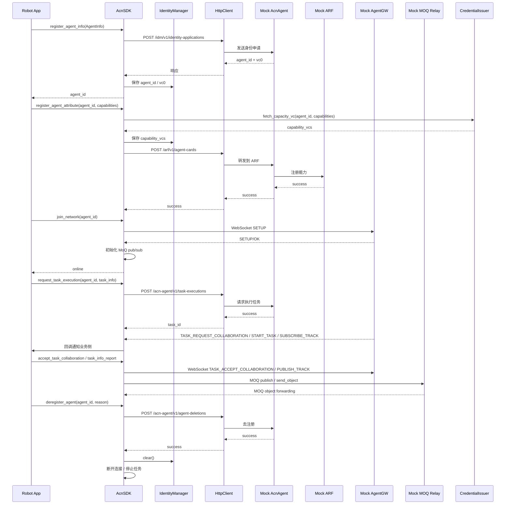

# 系统架构与模块设计

## 1. 总体说明

本工程只实现机器人端 `AcnSDK`，通过 HTTP 与核心网侧 `AcnAgent` 和 `ARF` 通信，通过 WebSocket 与 `AgentGW` 交互，通过 MOQ 与 relay 传输任务数据。仓库内提供 `mock_acn_agent`、`mock_arf`、`mock_agent_gw`、`mock_moq_relay` 四个本地测试桩，便于联调注册、入网、任务协同和对象转发链路。

## 2. 模块划分

当前代码的主要入口与分片如下：

```text
acn_sdk/
├── sdk.py
├── core/
│   ├── common.py
│   ├── models.py
│   ├── settings.py
│   ├── identity_service.py
│   ├── network_service.py
│   └── task_service.py
├── identity/
├── network/
├── credential/
├── task/
├── reporting/
└── utils/
```

- `acn_sdk/sdk.py`：`AcnSDK` 聚合入口，负责初始化配置、日志、密钥和各类服务对象。
- `core/common.py`：状态常量、公共工具函数，以及任务/网络状态维护逻辑。
- `core/models.py`：`AgentInfo`、请求体模型和 WebSocket 消息模型。
- `core/settings.py`：`SDKConfig`、`NetworkConfig`、`StorageConfig` 配置模型与 YAML 加载保存。
- `core/identity_service.py`：身份申请、能力注册、查询和去注册。
- `core/network_service.py`：入网、退网、消息处理、MoQ 发布/订阅。
- `core/task_service.py`：任务执行、协同请求、任务终止和任务上报。
- `identity/IdentityManager`：本地身份状态持久化，保存 `agent_id`、`vc0`、`capability_vcs` 和机器人基础信息。
- `credential/CredentialIssuer`：模拟第三方能力凭证签发。
- `network/HttpClient`：统一发送 HTTP 请求并记录请求与响应日志。
- `network/WebSocketClient`：与 `AgentGW` 的长连接通信。
- `network/MoQClient`：基于 `moq.pub.MOQPublisher` / `moq.sub.MOQSubscriber` 的 track 发布、订阅与对象回调入口。
- `task/TaskManager`：统一管理后台任务生命周期。
- `reporting/PipelineLogReporter`：把关键请求路径和负载写入日志。

## 3. 核心流程



## 4. 状态设计

- 初始状态：`offline`
- 连接网络后：`online`
- 去注册或断开连接后：`offline`
- 任务上报前提：必须 `online`

状态切换通过日志输出，便于在 demo 中确认流程。

## 5. 配置设计

- `acn_sdk/core/settings.py` 负责配置结构和默认值。
- `acn_sdk/config/config.yaml` 是运行时优先读取的配置源。
- 启动时优先读取 `acn_sdk/config/config.yaml`，运行中需要热更新时调用 `AcnSDK.reload_config()`。

## 6. 扩展设计

- `HttpClient` 可替换为重试版、鉴权版或异步版。
- `IdentityManager` 可扩展为 SQLite 或加密存储。
- `CredentialIssuer` 未来可改为真实第三方服务调用。
- `mock_agent_gw` 当前负责 WebSocket 控制面联调和调试消息下发，不承担真实路由或鉴权能力。
- `mock_moq_relay` 基于 `moq.relay.MOQRelay` 运行，可用于本地真实 QUIC/MOQ 对象转发验证。
- `TaskManager` 已抽象出统一任务入口，便于扩展心跳、订阅和重连任务。
