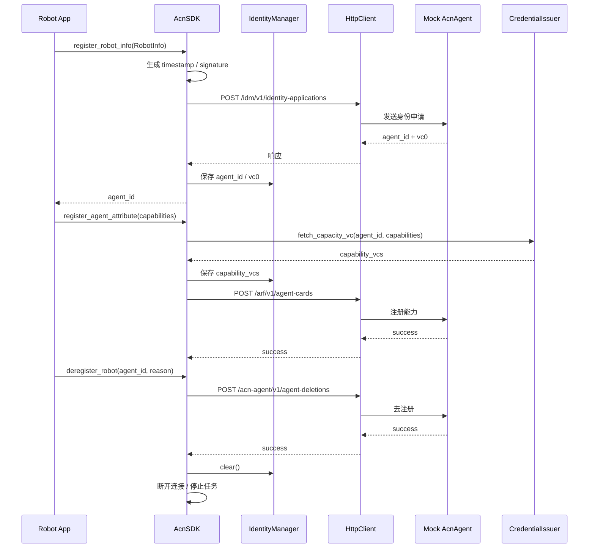
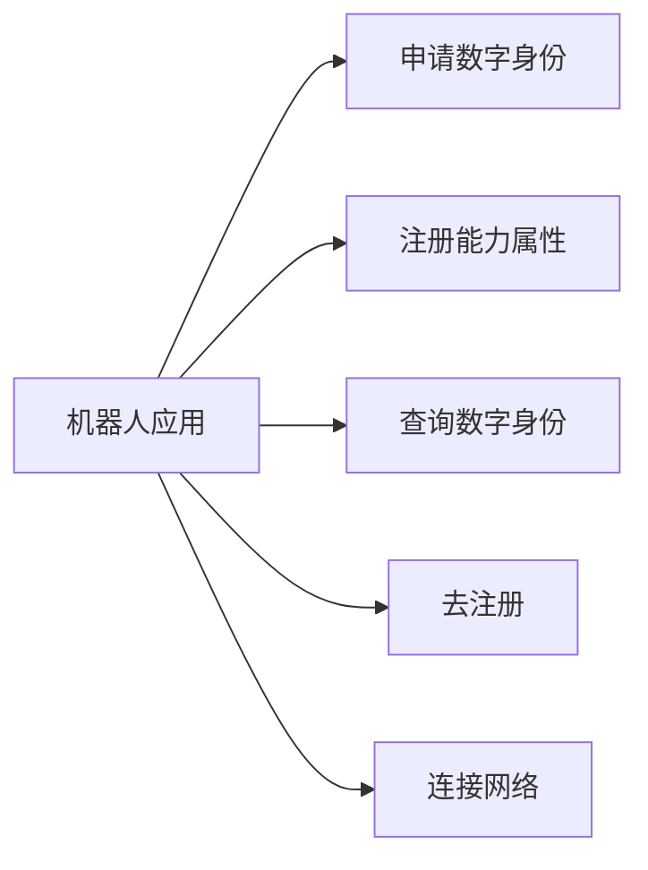

# 系统架构与模块设计

## 1. 总体说明

本工程只实现机器人端 `AcnSDK`，通过 HTTP 与核心网侧 `AcnAgent` 通信；`AgentGW`、MoQ 服务在当前版本中只保留客户端封装和测试桩接口，不实现真实网络侧业务逻辑。

## 2. 模块划分

目录分层如下：

```text
acn_sdk/
├── sdk.py
├── config.py
├── models.py
├── crypto.py
├── logging_config.py
├── identity/
├── network/
├── credential/
└── task/
```

- `AcnSDK`：主入口，编排身份申请、能力注册、查询、去注册、网络状态切换。
- `identity/IdentityManager`：本地身份状态持久化，保存 `agent_id`、`vc0`、`capability_vcs`、机器人基础信息。
- `credential/CredentialIssuer`：模拟第三方能力凭证签发。
- `network/HttpClient`：统一发送 HTTP 请求，记录请求与响应日志。
- `network/WebSocketClient`：预留与 `AgentGW` 的长连接通信能力。
- `network/MoQClient`：预留 track 发布/订阅封装。
- `task/TaskManager`：统一管理后台任务生命周期。
- `config.py`：定义 `SDKConfig` / `NetworkConfig` / `StorageConfig` 数据模型与默认值。
- `config/config.yaml`：运行时优先读取的配置文件，修改后可通过 `AcnSDK.reload_config()` 重新加载。
- `mock_acn_agent`：FastAPI 打桩服务，用于测试和本地调试。

## 3. 核心流程时序图



## 4. 用例图



## 5. 状态设计

- 初始状态：`OFFLINE`
- 连接网络后：`ONLINE`
- 去注册或断开连接后：`OFFLINE`

状态切换均通过 `logging` 输出。

## 6. 配置设计

- `config.py` 只负责配置结构与默认值，不作为运行时配置入口。
- `config/config.yaml` 是当前工程的运行时配置源。
- 启动时优先读取 `config/config.yaml`，运行中需要热更新时调用 `AcnSDK.reload_config()`。

## 7. 扩展设计

- `HttpClient` 可替换为重试版、鉴权版、异步版。
- `IdentityManager` 可扩展为 SQLite 或加密存储。
- `CredentialIssuer` 未来可改为真实第三方服务调用。
- `MoQClient` 当前为占位封装，后续可替换为真实 QUIC/MoQ 实现。
- `TaskManager` 已抽象出统一任务入口，便于扩展心跳、订阅、重连任务。
