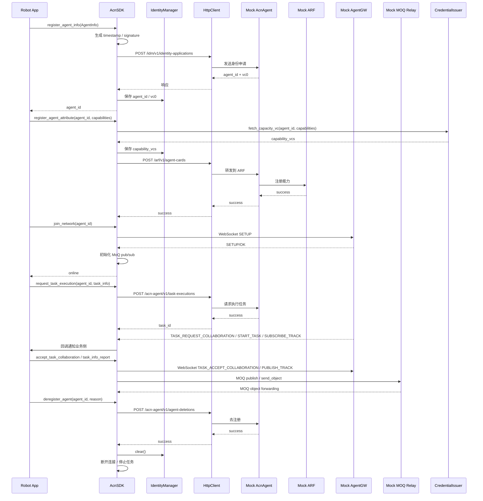
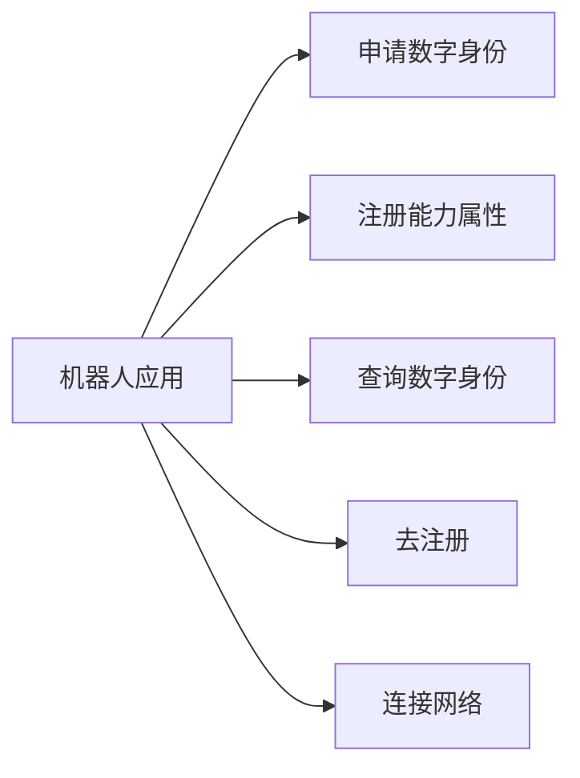

# 系统架构与模块设计

## 1. 总体说明

本工程只实现机器人端 `AcnSDK`，通过 HTTP 与核心网侧 `AcnAgent` 和 `ARF` 通信，通过 WebSocket 与 `AgentGW` 交互，通过 MOQ 与 relay 传输任务数据；当前工程提供 `mock_acn_agent`、`mock_arf`、`mock_agent_gw`、`mock_moq_relay` 四个本地测试桩，便于联调注册、入网、任务协同和对象转发链路。

## 2. 模块划分

目录分层如下：

```text
acn_sdk/
├── sdk.py
├── config.py
├── models.py
├── crypto.py
├── logging_config.py
├── identity/
├── network/
├── credential/
└── task/
```

- `AcnSDK`：主入口，编排身份申请、能力注册、查询、去注册、网络状态切换。
- `identity/IdentityManager`：本地身份状态持久化，保存 `agent_id`、`vc0`、`capability_vcs`、机器人基础信息。
- `credential/CredentialIssuer`：模拟第三方能力凭证签发。
- `network/HttpClient`：统一发送 HTTP 请求，记录请求与响应日志。
- `network/WebSocketClient`：预留与 `AgentGW` 的长连接通信能力。
- `network/MoQClient`：基于 `moq.pub.MOQPublisher` / `moq.sub.MOQSubscriber` 的 track 发布、订阅与对象回调入口。
- `task/TaskManager`：统一管理后台任务生命周期。
- `config.py`：定义 `SDKConfig` / `NetworkConfig` / `StorageConfig` 数据模型与默认值。
- `config/config.yaml`：运行时优先读取的配置文件，修改后可通过 `AcnSDK.reload_config()` 重新加载。
- `mock_acn_agent`：FastAPI 打桩服务，承载身份注册、任务执行、终止任务和去注册接口。
- `mock_arf`：FastAPI 打桩服务，承载能力注册和协同发现接口。

## 3. 核心流程时序图



## 4. 用例图



## 5. 状态设计

- 初始状态：`offline`
- 连接网络后：`online`
- 去注册或断开连接后：`offline`
- 任务上报前提：必须 `online`

状态切换均通过 `logging` 输出。

## 6. 配置设计

- `config.py` 只负责配置结构与默认值，不作为运行时配置入口。
- `config/config.yaml` 是当前工程的运行时配置源。
- 启动时优先读取 `config/config.yaml`，运行中需要热更新时调用 `AcnSDK.reload_config()`。

## 7. 扩展设计

- `HttpClient` 可替换为重试版、鉴权版、异步版。
- `IdentityManager` 可扩展为 SQLite 或加密存储。
- `CredentialIssuer` 未来可改为真实第三方服务调用。
- `mock_agent_gw` 当前负责 WebSocket 控制面联调和调试消息下发，不承担真实路由或鉴权能力。
- `mock_moq_relay` 基于 `moq.relay.MOQRelay` 运行，当前已可用于本地真实 QUIC/MOQ 对象转发验证。
- `TaskManager` 已抽象出统一任务入口，便于扩展心跳、订阅、重连任务。
